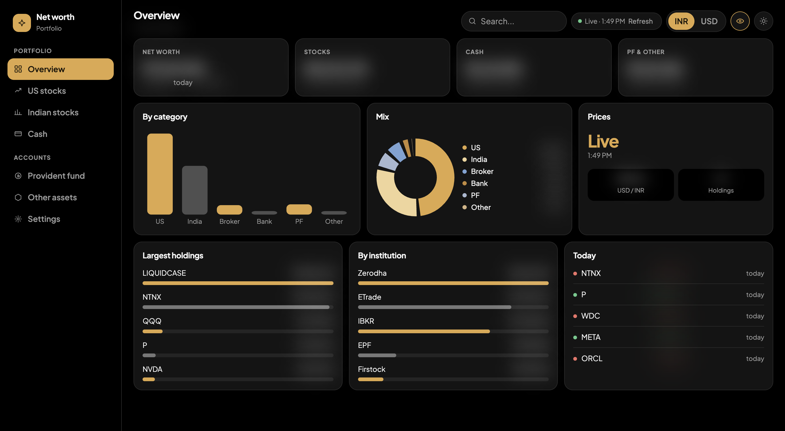

# Net worth tracker

1. Install Python 3.8+ (no other packages needed).
2. In this folder run: `python3 server.py`
3. Open http://localhost:8787

The server fetches live prices from Yahoo Finance each time you load or refresh the page.
If it isn't running, the dashboard still works using your fallback prices or the last known live prices.

Symbols: US stocks use the plain ticker (AAPL). Indian stocks use the plain symbol plus NSE or BSE (RELIANCE).
Crypto and other assets can use any Yahoo symbol, e.g. BTC-USD. The USD/INR rate uses USDINR=X.

Your holdings are stored in your browser (localStorage). Use Settings > Export backup to save them.

If prices can't be fetched (for example right after the Mac wakes, before the network is back), the page retries on its own after 10 seconds, backing off to every 2 minutes, and refreshes when you come back to a tab that has been idle for 5 minutes.

## Net worth history
While the server runs, it records your net worth once a day in `history.jsonl` next to `data.json` (change with HISTORY_FILE=/path/file.jsonl). The overview shows it as a chart.
The laptop does not need to be on every day. Each day is valued at that day's closing prices, so days the Mac was closed or asleep are filled in the next time the server runs, using the holdings you had then. A day stays provisional until noon the next day, when every market has closed for it. Bank, PF and other manual balances stay at their last value across a gap.
A daily copy of the history file is kept in `data-backups/` (last 30 days).

## Keep it running on a Mac
Run `./install-mac.sh` once. It starts at every login and restarts if it crashes.
Remove it with `./uninstall-mac.sh`. Logs are in `logs/server.log` (rotated at 1 MB, 3 old files kept). If the server itself crashes, the traceback is in `logs/launchd.log`.
If you installed before logs moved out of /tmp, run `./install-mac.sh` again once.
Tip: keep this folder somewhere like ~/networth-tracker rather than Desktop, Documents or Downloads, which macOS can restrict for background jobs.

## Where your data lives
While the server is running, holdings are saved to `data.json` next to `server.py` (change with DATA_FILE=/path/file.json).
The first save each day keeps a copy of the previous file in `data-backups/` (last 30 days). Every save also keeps the file it replaced (last 30 saves). A browser that is behind another save is asked to reload the file instead of overwriting it.
To move to a new computer, copy `data.json` and `history.jsonl`. They contain your financial details, so keep the folder private.
If you open the dashboard without the server, data is kept in that browser only.
Edits to index.html take effect on refresh. After editing server.py or history.py, restart it:
`launchctl kickstart -k gui/$(id -u)/com.networth.tracker`
